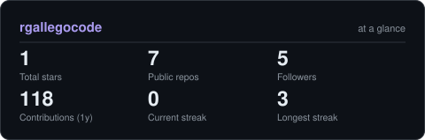

<div align="center">

<a href="https://github.com/rgallegocode">
  
</a>

<br>

<a href="https://www.linkedin.com/in/roberto-gallego-barbaran-5508b329b/"></a>&nbsp;&nbsp;
<a href="mailto:robertogallego004@gmail.com"></a>&nbsp;&nbsp;
<a href="https://rgallegocode.github.io/roberto-gallego-portfolio/"></a>

<br>


</div>

---

## This is me :)

Hi, I'm **Roberto**, a Software Engineering student and Backend & Blockchain Developer from Malaga, Spain. I build backend services and distributed systems, and I enjoy turning complex technical workflows into reliable software.

- **Software Engineering student at [University of Malaga](https://www.uma.es/)**, currently completing my BSc.
- **Backend and blockchain project contributor** in a university-industry collaboration with IOBuilders, working with Go, Daml and Canton.
- Focused on **Java/Spring Boot**, **Go**, **Python**, APIs, Docker and CI/CD.
- Interested in **blockchain, cloud infrastructure, distributed systems and secure software**.
- Spanish native and English C1. Based in Malaga and open to remote opportunities.

<div align="center">

```text
 ---:+%########=---------------------:--==--::----------------::::::::..:
 ====#%%%#####%#-=-----------------:::------------------::::::--:::::::::
 ---+%#######%#-----------:::.::::::::....:-----------:::----===----:----
 --=%######%%@+:-------::--+#%@@@@@@@@%#*+-:::::--------::::::::::-------
 ==-+%%%%###+-:----:::=*%@@@@@@@@@@@@@@@@@@%#+-:.::::----::::::---::.::--
 ----==+*###-:-==::=#@@@@@@@@@@@@@@@@@%%@@%@@@%*-::-------:::.::-----::.-
 ---=---:=*#*---.-@@@@@@@@@@@@@@@@@@@@@@@@@@@@@@@*::-------------------::
 -----=-=#*#%*::*@@@@@@@@@@@@@@@##%@@######%%@@@@@#-:--------------::::::
 -=-----+####-:@@@@@@@@@%#*+==-::.:::.:::::--=+*@@@@+::---------:::::::::
 --======***+=@@@@%@@%**+--:::::::...::::::::::--+%@@=:----:::::::-------
 -*%#*****+++@@@@@@@%+==------::::::::::::--------=#@%:----:::::-::::----
 ==*####**#*#@@@@@@%#+==-------:::::::::::------===#@@-:-----------:::---
 =-:-=+*###*%@@@@@@%##+====---::::::::::::.....:--=#@@-:----------------
 --------=*+#@@@@@@%#*++=-------:::...:.:-=+*####+=*@@=-=----------------
 ====---=**++@@@@@@@@*+++#@%%%@@@#*::-:+#%%%#**#%@+%@=------------------
 ==----=#*++=%@@@@@@*+*%#+=-:-=++==+-:-=+==++++++=++#@--=----------------
 =====-=****+#@@@@@%++**+=##%%%***-=+-:=+=++#%%*@%+=*#:------------------
 ====----=+**+@@@@@%+++=+*%***+=====+-::=+---========*=---------------===
 ========--+#**%%@@#++==+=---::::-====--=+=---::---==*=----------------==
 ======---+***=-==*#++==--------::-=*+=--=+-:-----==+=------:------------
 -------=+#**#+==-=##++=====---:::++++=::-++-:--===++:--==------=----::-
 *#**###%%***#*=::-+%*++++===-:::-+++*+++***=::-==+++==========-==---:--
 *###****++***#*++=-*%++++===-::---==-:---====---=+++--===---=======-----
 -==++*******++==*=:-%#*+++=--===----==+++====+=-=++*+++==============---
 ==---+****#+--=====+@***++=-====*#%%#####%%%*====+********+*******+====
 ======+#*###*=======@#**++==---=+++++===++**+--=+**--=++++*****+**+++++
 =====-=*****======-:#%#**+==-=------==++========*#=-----------====+++++
 ======+#**#*======--**+*#*+======---------==+++**=-====================
 ++===+#**##*==++===-**==*#**+++====-:---==+=+***+=++==-========---------
 ++++++#####*=======-**====++**#*++++++=++*****++-:-=+*++===++++++++=====
 ***+++=++####**====:+*=======+*****#*********++*:     =***++++**********
 +++++====+###%*=:.:+%*=======+++++++++++++***++++-      :+*****++*******
 +====+++=*%@%: .:=*#**===--===++++++====+****++++*         .:-==+==-----
 =++++++++%%=:  *#*+++*+====-====+++++++++++++=+++*.             .-======
 ****++**+-      =+=++*+=====-=--=========+++==+++*:                .:=+*
  ++++++-          :===++===-------=======+++==++++*
```

</div>

<br>

<div align="center">

## my perfect stack`


</div>

---

<div align="center">

## signals

<table>
<tr>
<td width="50%" align="center" valign="middle">

<picture>
  <source media="(prefers-color-scheme: dark)" srcset="assets/radar-dark.svg">
  <source media="(prefers-color-scheme: light)" srcset="assets/radar-light.svg">
  
</picture>

</td>
<td width="50%" align="center" valign="middle">

<picture>
  <source media="(prefers-color-scheme: dark)" srcset="assets/radar-langs-dark.svg">
  <source media="(prefers-color-scheme: light)" srcset="assets/radar-langs-light.svg">
  
</picture>

</td>
</tr>
</table>

</div>

---

<div align="center">

## Numbers matter? ohhh yes.

<picture>
  <source media="(prefers-color-scheme: dark)" srcset="assets/card-stats-dark.svg">
  <source media="(prefers-color-scheme: light)" srcset="assets/card-stats-light.svg">
  
</picture>

</div>

---

## Featured projects

### Tokenized bonds on Canton

University-industry collaboration with IOBuilders. Contributed to a digital-bond platform built with Go, Daml and Canton, including a Dockerized multi-participant network, ledger API integration, Nginx frontend and Playwright end-to-end tests.

<a href="https://github.com/JavierStark/Project-CantonDaml-IoBuilders-UMA"></a>

### Cava Bot

Personal Python Telegram bot that combines financial news, market data and Gemini-based summarization into a scheduled daily briefing, automated with GitHub Actions and cron without a dedicated server.

<a href="https://github.com/rgallegocode/cava-bot"></a>

### Bancosol Campañas

University team project built with Java and Spring MVC for managing food-collection campaigns. Implemented the Captain module, authenticated-user filtering and role-based access control with Spring Security and JWT.

<a href="https://github.com/rgallegocode/Bancosol"></a>

---

<div align="center">

<sub>` Build carefully · Test relentlessly · Keep learning `</sub>

</div>
